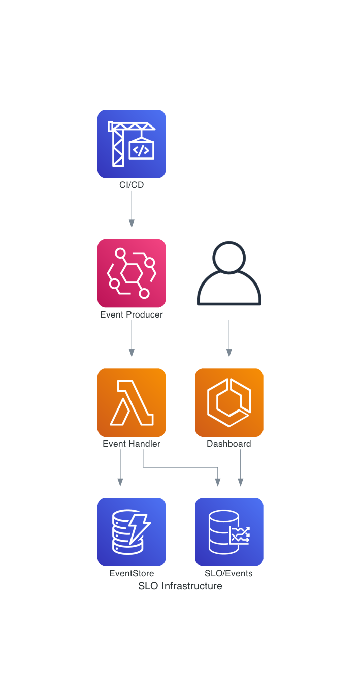

# tf2eventbridge

Sample repository for converting terraform plans into eventbridge events, so you can track infrastructure of interest.

This allows for tracking of SLOs as a platform engineering team for activities such as account requests, access requests, etc.

In a real-world scenario you would embed the `plan2event.py` into your CI build to generate the request events, and into your CD build to generate the created events. However, for the proof of concept we'll do that locally.

## Recording of Talk

### Slides

The slides are available [here](<./Progressive%20Delivery%20Conf%20(2).pdf>)

## Architecture

## How to use

### Assume a role that has organization access

1. `. awsume <your-role-name>`

### Deploy the backend infrastructure

1. `cd slo-infra`
2. `sls deploy -r eu-west-1`
3. `cd ..`

### Run the terraform plan for an account

1. `cd account`
2. `make init`
3. `make plan`

#### Generate the account requested event

1. `make requested`

#### Generate the account created event

1. `make created`

### Run the Grafana docker image

1. `cd ../dashboard`
2. `./build_and_run.sh`
3. Open `http://localhost:3000/d/g88YDO2Gz/slos?orgId=1`
4. Log in with `admin/admin`
